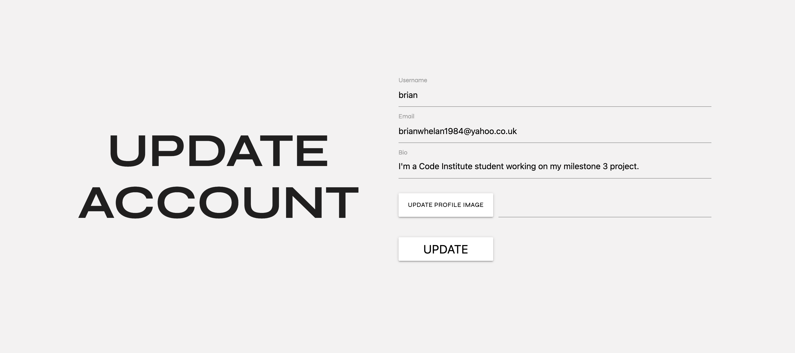
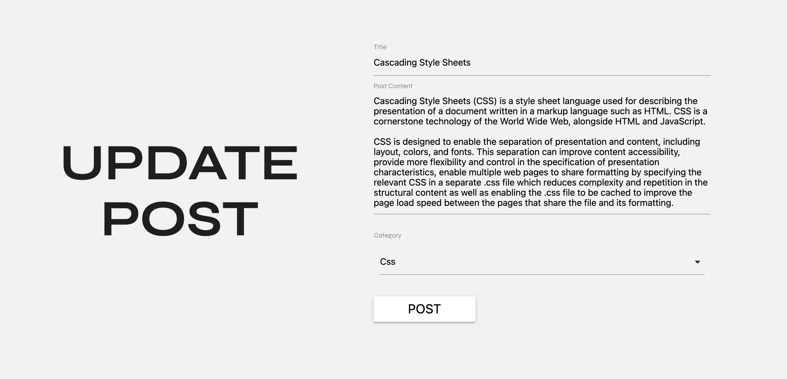

# Hello World!

## Milestone Project 3

- This project aims to build a full stack web application using the  python micro framework Flask, Mongdb database, HTML, Css3 and javascript.
- I have decided to build a social media blogging platform aimed at new developers to share notes on code they have learned with other each other.


## Live project

- [View the live project here.](https://hello-world-ms3.herokuapp.com/)

## Screenshots

### Home page screenshot.

<div align="center"></div>

### Signup page screenshot.

<div align="center"></div>

## Table of Contents.

- [Hello World!](#hello-world-)
  * [Milestone Project 3](#milestone-project-3)
  * [Live project](#live-project)
  * [Screenshots](#screenshots)
    + [Home page screenshot.](#home-page-screenshot)
    + [Signup page screenshot.](#signup-page-screenshot)
  * [Table of Contents.](#table-of-contents)
  * [User experience](#user-experience)
    + [User Stories](#user-stories)
    + [WireFrames](#wireframes)
    + [Database Models and Schema](#database-models-and-schema)
      - [Database Models](#database-models)
      - [Database Schema](#database-schema)
      - [MogoDb](#mogodb)
  * [Design](#design)
      - [Colour Scheme](#colour-scheme)
      - [Colour Scheme](#colour-scheme-1)
      - [Typography](#typography)
  * [Features](#features)
    + [Main](#main)
      - [Landing page.](#landing-page)
      - [Interactive navigation.](#interactive-navigation)
      - [About Us page.](#about-us-page)
      - [Contact us page.](#contact-us-page)
    + [Users](#users)
      - [Sign Up.](#sign-up)
      - [Login.](#login)
      - [Account](#account)
      - [Update account.](#update-account)
      - [Delete account.](#delete-account)
    + [Posts](#posts)
      - [Recent Posts.](#recent-posts)
      - [Post page.](#post-page)
      - [Add post.](#add-post)
      - [Update post](#update-post)
      - [Delete Post.](#delete-post)
      - [Comments.](#comments)
      - [Likes.](#likes)
      - [Search and Categories.](#search-and-categories)
    + [Admin](#admin)
      - [Dashboard.](#dashboard)
    + [Custom Error Pages](#custom-error-pages)
    + [Features left to Implement.](#features-left-to-implement)
  * [Technologies used.](#technologies-used)
    + [Flask](#flask)
    + [Languages Used.](#languages-used)
    + [Flask and Flask extensions used](#flask-and-flask-extensions-used)
    + [Frameworks Libraries and Programs.](#frameworks-libraries-and-programs)
  * [Testing](#testing)
      - [Testing.](#testing)
  * [Deployment](#deployment)
    + [Github, Gitpod, Git and Heroku](#github--gitpod--git-and-heroku)
      - [To start the project I used Github and Gitpod.](#to-start-the-project-i-used-github-and-gitpod)
      - [Git](#git)
      - [Heroku](#heroku)
  * [Credits](#credits)
    + [Code](#code)
      - [Stack Overflow.](#stack-overflow)
      - [Code Inspiration](#code-inspiration)
      - [Tutorials.](#tutorials)
        * [Mega Flask Tutorial.](#mega-flask-tutorial)
        * [Julian nash Flask series Youtube.](#julian-nash-flask-series-youtube)
        * [Tyler pots youtube.](#tyler-pots-youtube)
      - [Code Institute.](#code-institute)
      - [Webaim](#webaim)
    + [Content](#content)
    + [Media](#media)
    + [Acknowledgements](#acknowledgements)

<small><i><a href='http://ecotrust-canada.github.io/markdown-toc/'>Table of contents generated with markdown-toc</a></i></small>


## User experience

### User Stories

- New Visitor

  - As a new user, I would like to know what the website is about upon opening the site.
  - As a new user, I would like to get information about the website.
  - As a new user, I would like to see some posts on the site.
  - As a new user, I would like to easily register for the site.
  - As a new user, I would like to add a bio and an image to my user account..
  - As a new user, I would like to add a new post to the blog.

- Repeat users

  - As a repeat user, I would like to easily login upon opening the site.
  - As a repeat user, I would like to be able to like posts.
  - As a repeat user, I would like to be able to comment on posts.
  - As a repeat user, I would like to edit and delete my posts.
  - As a repeat user, I would like to be able to edit and delete my account.

-  All users.

   - As a user, I would like to get feedback when I have completed an action on the site.
   - As a user, I would like to be able to contact the website owners if there is an issue.

- Website owner

  - As the owner, I want the user to be able to find information easily.
  - As the owner, I want the user to be able to sign up or log in easily.
  - As the owner, I only want users who have signed up and logged in to see the full post page.
  - As a site owner, I only want the user to be able to delete their own posts or comments.
  - As a site owner, I want to be able to see how many users there are and how many posts.
  - As a site owner, I want the ability to delete any post regardless to who has written them, eg they are offensive etc.

### WireFrames

- I've created WireFrames using Balsamiq and have included the links to access them in pdf form.

  - Phone
    - [Wireframes for phones.](readme-images/wireframes/ms3-phone-wf.pdf)
  - Tablet
    - [Wireframes for tablets.](readme-images/wireframes/ms3-tablet-wf.pdf)
  - Desktop
    - [Wireframes for desktops.](readme-images/wireframes/ms3-desktop-wf.pdf)

### Database Models and Schema

  #### Database Models
  
  - My database consists of four collections.
    - Users
    - Posts
    - Categories
    - Comments.

  - Users
    - The Users collection contains information about the user.
    - It also contains a one to many relationship with the Posts models for the users liked posts.

  - Posts 
    - The Posts model contains the information for each post.
    - It also contains a relationship with usermodel for the Post author field.
    - It then contains 2 list fields.
       1. One for the users who have liked the post.
       2. A list of the id for each comment on the post.
    - It also contains a relationship with the category model for each post.

  - Categories
    - The category model contains a category name which and id whivh is then referenced in the posts model.

  - Comments.
    - The comments Model contains each comments content and date.
    - It then contains a reference to the users id who wrote the post.
    - It then also contains a reference to the id for the post it belongs too.


#### Database Schema

  - My database schema is shown in the following diagram.

    - 


#### MogoDb

- [MongoDb](https://www.mongodb.com/)

 - MongoDB was used as the project database. 
  - I followed the following steps to set it up.
    
    - I signed up to MongoDB and the selected the create a shared cluster option.
    - I the selected Aws as my cloud provider and then selected my region.
    - Then I selected The M0 cluster tier.
    - I then named my cluster and created it. 
    - Once the cluster was created I clicked on database access and added in the database user details.
    - Then I set the database user privileges to read and write to the database.
    - I then clicked add a user.
    - Then in the security menu, I clicked on network access.
    - Then click on the add IP address.
    - I then allowed access from anywhere.
    - Now we can start to add collections.
    - I clicked on add my own data and the named my database and collection.
    - To connect to the database I clicked on the connect button then the connect your application button.
    - Then I copied the Url and placed in within an environmental variable in my app.
    - I then used Flask-Mongoengine to interact with my database from the application.

## Design

#### Colour Scheme

#### Colour Scheme

- I've created a light theme for this website using a stone background colour named cultured. My text is in black to contrast against the lighter background. I have used a bold Imperial red colour for the navigation background and button hovers to give the site a pop of colour.

  - <p align="center"></p>

#### Typography

- I've used one font in different weights for headings and text element across the site to create a uniform theme throughout all the text.
  I've imported the Syne font to my CSS stylesheet from Google Fonts.
  I used sans-serif as a fall-back font in the case for any reason my fonts were not imported.
  
  - <p align="center"></p>


## Features

### Main


  - #### Landing page.
    - When a user opens the site they are presented with the landing page.
    - It contains a clear title and information about the application.
    - There are also links to signup or login.
    - There is an about us section and there is a section showing the last four posts that have been posted.

    - <div float="left">
        
      </div>

  - #### Interactive navigation.
    - The navigation menu has been made interactive by the use of javascript.
    - When the user clicks on the hamburger icon the navigation will appear.
    - The navigation items have been coded to change when a user has signed up and logged in.
    
    - <div float="left">
        
      </div>

  - #### About Us page.
    - The about us page gives the user information about the site.

    - <div float="left">
        
      </div>

  - #### Contact us page.
    - The contact us page contains a heading and a contact form.
    - Upon submittal of the form Flask-mail will send the site owner an email containing the message and the user's contact information.

    - <div float="left">
        
      </div>

### Users


  - #### Sign Up.
    - The signup page contains a form for users to sign up.
    - Once the user fills the form and submits their details are stored in the database.
    - The user is then directed to the login paged and a message is flashed to say that signup was successful.
    
    
    - <div float="left">
        
      </div>

  - #### Login.
    - The login page contains a form for the user to login.
    - Once the user enters the correct details they are logged in and redirected to the recent posts page.
    - A message will flash to tell the user they were logged in successfully.

    - <div float="left">
        
      </div>

  - #### Account
    - Each user has access to an account page containing their details.
    - The user then has the options, to update or delete their account.

    - <div float="left">
        
      </div>

  - #### Update account.
    - The updated account page contains a form to allow the user to update their account information.
    - Upon opening the form details will be prefilled with information from the database.
    - Here they can also add a bio about themselves.
    - They can also add a user image.
    - The user image is sent to Cloudinary and the response URL is then stored in the database including sizing parameters.
    
    
    - <div float="left">
        
      </div>

  - #### Delete account.
     - If the user decides to delete their account they will be presented with a modal to confirm this.
     - If the chose to cancel they will be directed back to their account page.
     - If the click delete their user details and any posts and comments they have made will be deleted.

    - <div float="left">
        
      </div>


### Posts


  - #### Recent Posts.
    - The user must log in to see this page. 
    - Once a user has logged in they will be directed to this page.
    - The posts are shown by most recent and they are paginated showing 4 posts per page.
    - The user can then click on the find out more option and be directed to the post page to see the full post.

    
    - <div float="left">
        
      </div>

 - #### Post page.
    - This page will display each post and their comments and likes.
    
    - <div float="left">
        
      </div>


  - #### Add post.
    - Each user can add posts to the application.
    - This page contains a form for the user to add their post.
    - On form submittal, the post is then saved to the database.
    
    - <div float="left">
        
      </div>

  - #### Update post
    - If the current user has written this post they will be presented with the update and edit buttons.
    - They will not show for any other user apart from the admin.
  
    - <div float="left">
        
      </div>
    
    - The user can then change their post details here on the update post page.
    - Upon opening the form will prefill with data from the database.
    - Upon form submittal, the data will be saved to the database.

     - <div float="left">
        
      </div>


  - #### Delete Post.
     - If the user decides to delete the post they will be presented with a modal to confirm this.
     - If the chose to cancel they will be directed back to the post page.
     - If they click delete the post will then be deleted.
   
    - <div float="left">
        
      </div>

  - #### Comments.
    - Each post has a comments section where a user can leave a comment.
    - Once the user submits a comment it is saved in the database.
    - Each comment can then be updated or deleted by their author or the admin user.


    - <div float="left">
        
      </div>

   - #### Likes.
     - Each post also has a likes button that a user can click to like the post.

   - #### Search and Categories.
     - The is also a search function to search through the posts 
     - On form submittal, the application will search the posts in the database.
     - If no results are found the user is redirected back to the referral page and a message is flashed to say that there were no results.
     - There is a categories list also to show posts for each category.
       
        - <div float="left">
        
      </div>
 ### Admin


  - #### Dashboard.
    - The application has been coded to have an "admin" user.
    - The admin has access to the dashboard page.
    - If a user gets to this page who isn't admin they will get a 403 error.
    - The dashboard contains information on the number of users and posts.
    - It also gives the function to add, edit or delete, categories.
    - If they want to delete a category they will get a warning screen to confirm this action.
    - The admin also has access to delete posts and comments in case they contain content that isn't allowed.

    
    - <div float="left">
        
      </div>


### Custom Error Pages
  - I have created an errors blueprint to deal with page errors.
  - I have used the flask app_error handlers to render the error pages.
  - Each page contains a reason for the error and a navigation link to return to the home page. It also has access to the navigation menu.
  - 404 - not found  error
  - 403 - no permission error
  - 500 - server error.

### Features left to Implement.

In the future, it would be nice to implement some other features.
 - A feature to follow other users.
 - A notification feature when someone comments on or likes your post.
 - A more detailed account page that users can search each other.

## Technologies used.

### Flask

- The application was built on the Flask framework. 
- I've used Flask Blueprints to split my application up into modules.
  - Main
  - Users
  - Posts
  - Admin
  - Errors
- This makes it easier to find routes and elements if they need to be updated or changed.
- The templates folder is also split into a similar structure.
  - Base 
  - Admin
  - Errors
  - Main
  - Posts
  - Users
- I've also created a ``` config.py ``` file for the apps configuration settings.
- Then within the applications  ```__init__.py ``` file I've created the app as a Flask application factory. Initialising my extensions and importing and initialising my blueprints.
- Then in the ``` app.py ``` file the application factury is imported and the function is the invoked ie. ``` app = create_app() ``` which then creates the application.

### Languages Used.

- [HTML5](https://en.wikipedia.org/wiki/HTML5)

  - HTML5 was used to create the content and base of each page.

- [CSS3](https://en.wikipedia.org/wiki/CSS)

  - CSS3 was used to then style the page and make it responsive through media queries, and interactive through using CSS transitions.

- [javaScript](https://en.wikipedia.org/wiki/JavaScript)
  - javaScript was used throughout the website to make the site interactive.

- [Python](https://en.wikipedia.org/wiki/Python_(programming_language))
  - Python was used to build the backend functionality of the web app.

### Flask and Flask extensions used

- [Flask](https://flask.palletsprojects.com/en/1.1.x/)

  - Flask micro framework was used to build the web app using python code.

- [Flask-bcrypt](https://flask-bcrypt.readthedocs.io/en/latest/)

  - Flask bcrypt was used to has the users password before storing it in the database.

- [Flask-login](https://flask-login.readthedocs.io/en/latest/)

  - Flask login was used to manage logged in users.

- [Flask-mail](https://flask-login.readthedocs.io/en/latest/)

  - Flask mail was used to send an email for the contact form.

- [Flask-mail](https://pythonhosted.org/Flask-Mail/)

  - Flask mail was used to send an email for the contact form.

- [Flask-mongoengine](http://docs.mongoengine.org/projects/flask-mongoengine/en/latest/)

  - Flask mongoengine was used to interact with the database.

- [Flask-mongoengine](http://docs.mongoengine.org/projects/flask-mongoengine/en/latest/)

  - Flask mongoengine was used to interact with the database.

- [Flask-Wtf](https://flask-wtf.readthedocs.io/en/stable/)

  - Flask-Wtf was used to created the forms and validate them.

- [Gunicorn](https://gunicorn.org/)

  - Gunicorn was used to help deploy the application to heroku.


### Frameworks Libraries and Programs.

- [Cloudinary](https://cloudinary.com/)

  - Cloudinary was used to store the users profile image.

- [Google Fonts](https://fonts.google.com/)

  - I imported the Mulish font from google fonts and used it consistently across the site.

- [Line awesome](https://icons8.com/line-awesome)

  - I used different icons from Line awesome for icons in the application.

- [Materialize](https://materializecss.com/)

  - Materialize Css was used for its grid system and it's form inputs.

- [Quick Database Diagrams](https://www.quickdatabasediagrams.com/)

  - I used quick database diagrams to make a digram of my database schema.

- [Git](https://git-scm.com/)

  - Git was used as a version control in the terminal.

- [Github](https://github.com/)

  - Github was used to create and store the project repository.

- [Gitpod](https://gitpod.io/)

  - Gitpod was used to create my files and code the project.

- [Balsamiq](https://balsamiq.com/)

  - Balsamiq was used to create Wireframes for the project during the initial planning stage.

- [Am I responsive](http://ami.responsivedesign.is/)

  - Am I responsive was used to taking screenshots of the page at different screen sizes.

- [jQuery](https://jquery.com/)

  - jQuery was used to initialize materialize functions.

- [Cypress](https://www.cypress.io/)

  - Cypress was used to writing and execute automated tests for the page.

- [Markdown toc](http://ecotrust-canada.github.io/markdown-toc/)

  - Markdown toc was used to create my table of contents.

## Testing

- #### Testing.
  - The testing section for this site is located at the following link.
    - [Testing file](TESTING.md)

## Deployment

### Github, Gitpod, Git and Heroku

- #### To start the project I used Github and Gitpod.

  1. I first signed into Github and located the Code Institute Gitpod template.

     - <div float="left">
          
        </div>

  2. I then clicked the use this template button.

     - <div float="left">
           
         </div>

  3. I then named the repository and created it.

     - <div float="left">
           
         </div>

  4. Once the repository was created I could then open it on Gitpod.

  5. I then used my terminal to create my files and folders and start coding the application.


- #### Git

  1. Throughout the project I used git to save and store my progress.

  2. Once I completed a section I used git add command to add the changes I had made to the staging area.

     - 

  3. Once the file was staged I the used the git commit command to commit the changes.

     - .

  4. Then the changes were pushed to Github using git push command.

     - 

  5. The above steps were used for each stage of development throughout the project.

- #### Heroku
  
  - The project has been deployed on heroku. To achieve this I followed the following steps.

  1. Create a requirements.tx file typing the following command into your terminal. 

        ```
            pip3 freeze --locak > requirements.Text
        ```
  2. Then create the procfile by typing the following comand into the terminal.

        ``` 
           echo web: python app.py > procfile
        ```
  3. Once your procfile has been created make sure there is no blank line at the end of the procfile as it can cause isssues if there is.

  4. Signin to Heroku.com and select new button then the create a new app option.

     - <div float="left">
          
        </div>

  5. Then name your app and select your region. Your name must be unique.
      
     - <div float="left">
          
        </div>
  
  6. Then click the create app button.

  7. On the next screen click the connect to github buttton.

       - <div float="left">
          
        </div>
    
  8. Then add your projects repository name and search for it.

      - <div float="left">
          
       </div>

  9. Once the repository has been found click connect button.

  10.  Then click on the setting button
      
       - <div float="left">
          
       </div>

  11. Then click on the reveal config variables button.

     - <div float="left">
          
       </div>
  
  12. Add your config variable key values to this section.

      - <div float="left">
          
       </div>
    
  13. Confirm that both your Procfile and your requirements have been commited and pushed to github.

      - <div float="left">
          
       </div>
  
  14. Then enable automatic deploys and then click the deploy branch button.

      - <div float="left">
          
       </div>

  15. Heroku will now build and deploy your application. It will also automatically update it everytime you add a commit to your github repository.

## Credits


### Code

- #### Stack Overflow.

- [Flask-login Usermixin](https://stackoverflow.com/questions/54992412/flask-login-usermixin-class-with-a-mongodb)

    - I used the above code to help me understand using the Usermixin class for flask Login.

 - [User pressing backbutton](https://stackoverflow.com/questions/20652784/flask-back-button-returns-to-session-even-after-logout)

    - I used the above code to fix an issue I had that when a user logged out and hit the back button the cache was allowing them to still visit a page they needed to be logged in for.

- #### Code Inspiration

- [Sante](https://github.com/AudreyLL88/MS3__Sante)

   - Sante is a project by another code institute student I noticed on the slack, code peer review channel.
   - I noticed she had a like function which was something I wanted to implement also.
   - I used her code for the like function as inspiration, and her code helped me understand how to implement this function within my own project.

- ####  Tutorials.

  - I used two main tutorials on youtube to learn to have an interactive navbar and also how to fade elements in upon scrolling. I have used some elements of the code but have edited it to fit this website.

    - ##### Mega Flask Tutorial.

      - [Mega Flask Tutorial](https://blog.miguelgrinberg.com/post/the-flask-mega-tutorial-part-i-hello-world)

        - I used the above tutorial to help me understand flask better. It was here I learned about blueprints and application factories and structuring my application.

    - ##### Julian nash Flask series Youtube.

      - [Julian nash flask tutorials](https://www.youtube.com/watch?v=BUmUV8YOzgM&list=PLF2JzgCW6-YY_TZCmBrbOpgx5pSNBD0_L)

        - I used the above tutorial to again help with my understanding of building a flask application.

     - ##### Tyler pots youtube.

      - [Page transitions]()

        - I used the above tutorial to help place a smooth transition between page changes. I have adapted the code to fit this project.

- #### Code Institute.

  - [My version of the todo application](https://github.com/BrianWhelanDublin/task_manager_app)

    - I used the Code Institue task management application to help with this project also.

- #### Webaim

      - [Webaim](https://webaim.org/techniques/css/invisiblecontent/)

    - I used this code from webaim to create a sr-only class as I wasnt using bootstrap.
    

### Content

- All Text for the website was written by myself.

- Text for the posts has been taken from wikipedia.

- User images have been taken from unsplash.

### Media

### Acknowledgements

- Code Institute for getting me to this point

- My Mentor for his help with this project.
