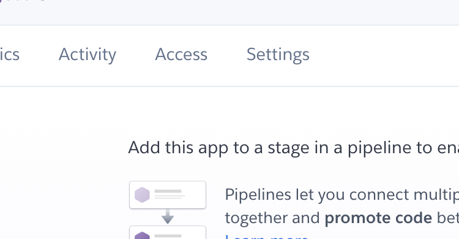

# Hello World!

## Milestone Project 3

- This project aims to build a full stack web application using the  python micro framework Flask, Mongdb database, HTML, Css3 and javascript.
- I have decided to build a social media blogging platform aimed at new developers to share notes on code they have learned with other each other.


## Live project

- [View the live project here.](https://hello-world-ms3.herokuapp.com/)

## Screenshots


## Table of Contents.

## User experience

### User Stories

- New Visitor

  - As a new user, I would like to know what the website is about upon opening the site.
  - As a new user,I would like to get information about the website.
  - As a new user, I would like to see some posts on the site.
  - As a new user, I would like to easily register as a new user.
  - As a new user, I would like to add a bio and an image to my user account..
  - As a new user, I would like to add a new post to the blog.

- Repeat users

  - As a repeat user, I would like to easily login upon opening the site.
  - As a repeat user, I would like to be able to like posts.
  - As a repeat user, I would like to be able to comment on posts.
  - As a repeat user, I would like to edit and delete my posts.
  - As a repeat user, I would like to be able edit and delete my account.

-  All users.

   - As a user, I would like to get feedback when I have completed an action on    the site.
   - As a user, I would like to be able to contact the website owners if there     is an issue.
   - As a user, I would like see the websites social media links.

- Website owner

  - As the owner, I want the user to be able to find information easily.
  - As the owner, I want the user to be able to sign up or login easily.
  - As the owner, I only want users who have signed up and loged in to see the full post page.
  - As a site owner, I only want the user to be able to delete their own posts, or comments.
  - As a site owner, I want to be able to see how many user there are and how many posts.
  - As a site owner, I want the ability to delete any post regardless to who has written them, eg they are offensive etc.

### WireFrames

- I've created WireFrames using Balsamiq and have included the links to access them in pdf form.

  - Phone
    - [Wireframes for phones.](readme-images/wireframes/ms3-phone-wf.pdf)
  - Tablet
    - [Wireframes for tablets.](readme-images/wireframes/ms3-tablet-wf.pdf)
  - Desktop
    - [Wireframes for desktops.](readme-images/wireframes/ms3-desktop-wf.pdf)

### Database Models and Schema

  #### Database Models
  
  - My database consists of four collections.
    - Users
    - Posts
    - Categories
    - Comments.

  - Users
    - The Users collection contains information about the user.
    - It also contains a one to many relationship with the Posts models for the users liked posts.

  - Posts 
    - The Posts model contains the information for each post.
    - It also contains a relationship with usermodel for the Post author field.
    - It then contains 2 list fields.
       1. One for the users who have liked the post.
       2. A list of the id for each comment on the post.
    - It also contains a relationship with the category model for each post.

  - Categories
    - The category model contains a category name which and id whivh is then referenced in the posts model.

  - Comments.
    - The comments Model contains each comments content and date.
    - It then contains a reference to the users id who wrote the post.
    - It then also contains a reference to the id for the post it belongs too.


#### Database Schema

  - My database schema is shown in the following diagram.

    - 


#### MogoDb

## Design

#### Colour Scheme


#### Typography


#### Imagery


#### Icons

## Features


### Custom Error Pages


### Features left to Implement.


## Technologies used.

### Languages Used.

- [HTML5](https://en.wikipedia.org/wiki/HTML5)

  - HTML5 was used to create the content and base of each page.

- [CSS3](https://en.wikipedia.org/wiki/CSS)

  - CSS3 was used to then style the page and make it responsive through media queries, and interactive through using CSS transitions.

- [javaScript](https://en.wikipedia.org/wiki/JavaScript)
  - javaScript was used throughout the website to make the site interactive.

- [Python](https://en.wikipedia.org/wiki/Python_(programming_language))
  - Python was used to build the backend functionality of the web app.

### Flask and Flask extensions used

- [Flask](https://flask.palletsprojects.com/en/1.1.x/)

  - Flask micro framework was used to build the web app using python code.

- [Flask-bcrypt](https://flask-bcrypt.readthedocs.io/en/latest/)

  - Flask bcrypt was used to has the users password before storing it in the database.

- [Flask-login](https://flask-login.readthedocs.io/en/latest/)

  - Flask login was used to manage logged in users.

- [Flask-mail](https://flask-login.readthedocs.io/en/latest/)

  - Flask mail was used to send an email for the contact form.

- [Flask-mail](https://pythonhosted.org/Flask-Mail/)

  - Flask mail was used to send an email for the contact form.

- [Flask-mongoengine](http://docs.mongoengine.org/projects/flask-mongoengine/en/latest/)

  - Flask mongoengine was used to interact with the database.

- [Flask-mongoengine](http://docs.mongoengine.org/projects/flask-mongoengine/en/latest/)

  - Flask mongoengine was used to interact with the database.

- [Flask-Wtf](https://flask-wtf.readthedocs.io/en/stable/)

  - Flask-Wtf was used to created the forms and validate them.

- [Gunicorn](https://gunicorn.org/)

  - Gunicorn was used to help deploy the application to heroku.


### Frameworks Libraries and Programs.

- [Cloudinary](https://cloudinary.com/)

  - Cloudinary was used to store the users profile image.

- [Google Fonts](https://fonts.google.com/)

  - I imported the Mulish font from google fonts and used it consistently across the site.

- [Line awesome](https://icons8.com/line-awesome)

  - I used different icons from Line awesome for icons in the application.

- [Materialize](https://materializecss.com/)

  - Materialize Css was used for its grid system and it's form inputs.

- [Quick Database Diagrams](https://www.quickdatabasediagrams.com/)

  - I used quick database diagrams to make a digram of my database schema.

- [Git](https://git-scm.com/)

  - Git was used as a version control in the terminal.

- [Github](https://github.com/)

  - Github was used to create and store the project repository.

- [Gitpod](https://gitpod.io/)

  - Gitpod was used to create my files and code the project.

- [Balsamiq](https://balsamiq.com/)

  - Balsamiq was used to create Wireframes for the project during the initial planning stage.

- [Am I responsive](http://ami.responsivedesign.is/)

  - Am I responsive was used to taking screenshots of the page at different screen sizes.

- [jQuery](https://jquery.com/)

  - jQuery was used to initialize materialize functions.

- [Cypress](https://www.cypress.io/)

  - Cypress was used to writing and execute automated tests for the page.

- [Markdown toc](http://ecotrust-canada.github.io/markdown-toc/)

  - Markdown toc was used to create my table of contents.

## Testing

- #### Testing.
  - The testing section for this site is located at the following link.
    - [Testing file](testing.md)

## Deployment

### Github, Gitpod, Git and Heroku

- #### To start the project I used Github and Gitpod.

  1. I first signed into Github and located the Code Institute Gitpod template.

     - <div float="left">
          
        </div>

  2. I then clicked the use this template button.

     - <div float="left">
           
         </div>

  3. I then named the repository and created it.

     - <div float="left">
           
         </div>

  4. Once the repository was created I could then open it on Gitpod.

  5. I then used my terminal to create my files and folders and start coding the application.


- #### Git

  1. Throughout the project I used git to save and store my progress.

  2. Once I completed a section I used git add command to add the changes I had made to the staging area.

     - 

  3. Once the file was staged I the used the git commit command to commit the changes.

     - .

  4. Then the changes were pushed to Github using git push command.

     - 

  5. The above steps were used for each stage of development throughout the project.

- #### Heroku
  
  - The project has been deployed on heroku. To achieve this I followed the following steps.

  1. Create a requirements.tx file typing the following command into your terminal. 

        ```
            pip3 freeze --locak > requirements.Text
        ```
  2. Then create the procfile by typing the following comand into the terminal.

        ``` 
           echo web: python app.py > procfile
        ```
  3. Once your procfile has been created make sure there is no blank line at the end of the procfile as it can cause isssues if there is.

  4. Signin to Heroku.com and select new button then the create a new app option.

     - <div float="left">
          
        </div>

  5. Then name your app and select your region. Your name must be unique.
      
     - <div float="left">
          
        </div>
  
  6. Then click the create app button.

  7. On the next screen click the connect to github buttton.

       - <div float="left">
          
        </div>
    
  8. Then add your projects repository name and search for it.

      - <div float="left">
          
       </div>

  9. Once the repository has been found click connect button.

  10.  Then click on the setting button
      
       - <div float="left">
          
       </div>

  11. Then click on the reveal config variables button.

     - <div float="left">
          
       </div>
  
  12. Add your config variable key values to this section.

      - <div float="left">
          
       </div>
    
  13. Confirm that both your Procfile and your requirements have been commited and pushed to github.

      - <div float="left">
          
       </div>
  
  14. Then enable automatic deploys and then click the deploy branch button.

      - <div float="left">
          
       </div>

  15. Heroku will now build and deploy your application. It will also automatically udpate it everytime you add a commit to your github repository.

## Credits


### Content

- All Text for the website was written by myself.

### Media

### Acknowledgements

- Code Institute for getting me to this point

- My Mentor for his help with this project.
