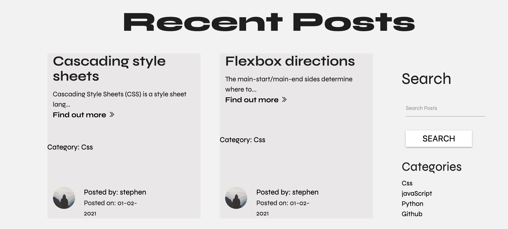

# Testing

- [Testing](#testing)
    + [User Stories](#user-stories)
  * [Test and bugs during development.](#test-and-bugs-during-development)
    + [Css transitions running upon page opening.](#css-transitions-running-upon-page-opening)
    + [Mongoengine](#mongoengine)
    + [Flask-Wtf forms](#flask-wtf-forms)
    + [Cache](#cache)
    + [Delete comment modal.](#delete-comment-modal)
      - [csrf tokens](#csrf-tokens)
  * [Defensive programming and Security.](#defensive-programming-and-security)
    + [Security](#security)
      - [Environmental variables](#environmental-variables)
      - [Users passwords.](#users-passwords)
    + [Logging in](#logging-in)
    + [Defensive Programming.](#defensive-programming)
  * [Manual Testing](#manual-testing)
    + [Procedure and results.](#procedure-and-results)
      - [User functionality](#user-functionality)
        * [Signup and login, Create.](#signup-and-login--create)
        * [User Account, Read and Update.](#user-account--read-and-update)
      - [Post, Comments, and Like Functionality Create, Read, Update, Delete.](#post--comments--and-like-functionality-create--read--update--delete)
        * [Create post](#create-post)
        * [Updating Posts.](#updating-posts)
        * [Like function](#like-function)
        * [Comments function.](#comments-function)
      - [Testing the search function.](#testing-the-search-function)
      - [Testing admin category function](#testing-admin-category-function)
  * [Validators](#validators)
      - [HTML](#html)
      - [CSS](#css)
      - [Javascript](#javascript)
  * [Responsiveness and Browsers](#responsiveness-and-browsers)
  * [Accessibility](#accessibility)
  * [Known bugs](#known-bugs)

<small><i><a href='http://ecotrust-canada.github.io/markdown-toc/'>Table of contents generated with markdown-toc</a></i></small>

### User Stories

- New Visitor

  - As a new user, I would like to know what the website is about upon opening the site.

    - The website landing page contains the main heading and a paragraph explaining what the application is for.
    - There is also an about us section just below and an about us page that's accessible from the navigation menu.

    - Landing page title
        - <div float="left">
            
        </div>

    - Landing page about section.
        - <div float="left">
            
        </div>


  - As a new user, I would like to get information about the website.
    - The user can visit the about us page to get information about the website.
    - The last 4 most recent posts are shown on the landing page to show the user what people are posting about.

    - About Page
        - <div float="left">
            
          </div>

  - As a new user, I would like to see some posts on the site.
      - As the user scrolls down the landing page they can see the last 4 most recent posts.

      - Landing page posts section 
        - <div float="left">
            
          </div>

  - As a new user, I would like to easily register for the site.
    - The landing page contains a link for users to get to the signup page.
    - The users can also get here from the navigation menu.

      - Landing page Signup link

        - <div float="left">
            
        </div>

    - Landing page navigation menu.

        - <div float="left">
            
        </div>


  - As a new user, I would like to add a bio and an image to my user account.
    - The user account will be filled with the user's details.
    - The user will have the option to add their own picture and a bio when the click on update account.

    - Users navigation menu

        - <div float="left">
            
        </div>

    - Account page with update and delete buttons.

        - <div float="left">
            
        </div>

     - Account page with update and delete buttons.

        - <div float="left">
            
        </div>
    
      - Update account page.

        - <div float="left">
            
        </div>

    - Account page with updated image and details.

        - <div float="left">
            
        </div>


  - As a new user, I would like to add a new post to the blog.
    - Once the user has registered and logged in the navigation menu will contain a link to the add post page.
    - Here the user can fill out the form to add a post.
    - Once the user fills in the form it will be saved in the database.

     - New post form
      - <div float="left">
            
        </div>


- Repeat users

  - As a repeat user, I would like to easily login upon opening the site.
    - The home page contains a link to the login page.
    - The user can also get here from the navigation menu.
       
       - Landing page login link

        - <div float="left">
            
        </div>
       
       - Landing page navigation menu.

        - <div float="left">
            
        </div>

  - As a repeat user, I would like to be able to like posts.
    - Each post has a like button that the user can click and it'll update with the number of likes the post has.

      - Post like button.

        - <div float="left">
            
        </div>

  - As a repeat user, I would like to be able to comment on posts.
    - Each post has a comment section where a user can fill in the form and upon submittal, the comment will be saved to the database and then appear on the site.
    - The user can then update or delete only their comments.
      
      - Post comment section.

        - <div float="left">
            
        </div>
    

  - As a repeat user, I would like to edit and delete my posts.
    - The post page will contain an update or delete button if the current user wrote the post
    - the user can then follow these to update or delete the post.

     - Update post form.

        - <div float="left">
            
        </div>
       
       - Delete post modal.

        - <div float="left">
            
        </div>


  - As a repeat user, I would like to be able to edit and delete my account.
    - The user can edit their account by clicking on the update account button.
    - They will then be taken to the update account form which will be prefilled with the data already stored in the database.
    - They can also delete their account by clicking on the delete account button. 
    - They will be shown a warning modal first to confirm they want to delete.

    - Update account

        - <div float="left">
            
        </div>
       
    - Delete post modal.

        - <div float="left">
            
        </div>
-  All users.

   - As a user, I would like to get feedback when I have completed an action on the site.
     - Flash messaging is used across each route to update the user when they have completed an action

      - Flashed message.

        - <div float="left">
            
        </div>

- As a user, I would like to be able to contact the website owners if there is an issue.
    - the navigation menu contains a link to the contact form.
    - Upon submit the user will be directed to the homepage and a message will flash telling them their contact message has been sent.
    - Flask-mail will then send a mail to the site owner.

    - Users navigation menu

        - <div float="left">
            
        </div>

    - Contact Form

        - <div float="left">
            
        </div>


- Website owner


  - As the owner, I want the user to be able to find information easily.
    - Information is made very clear and concise to the user. 
    - The about sections clearly describe the websites intentions.


  - As the owner, I want the user to be able to sign up or log in easily.
    - The home page contains both signup and login links as shown above.
    - The user can also navigate to them from the navigation menu as shown above.

  - As the owner, I only want users who have signed up and logged in to see the full post page.
    - If the user isn't authenticated they will be shown the landing page that only contains the last 4 posts summaries.
    - If they try to open these posts flask login will direct them to the login page.
    - Once they have logged in they will be brought to the home recent posts page.

    - Recent posts page.

        - <div float="left">
            
        </div>

  - As a site owner, I only want the user to be able to delete their own posts or comments.
    - I have used flask login to and jinja if statements to only allow the update and delete buttons if the current user is the post or comment author.
    - If the current user isn't the author these buttons will not appear.
    - I have also placed code to check if the current user is the author and if not the application will throw a 403 error

       - 403 error.

        - <div float="left">
            
        </div>


  - As a site owner, I want to be able to see how many users there are and how many posts.
    - The site owner has access as Admin that shows a dashboard containing information on the number of users and posts.
    - They also can add, update and delete comments.
      
       - Dashboard.

        - <div float="left">
            
        </div>

  - As a site owner, I want the ability to delete any post regardless to who has written them, eg they are offensive etc.
    - the application has been coded that if the current user is admin then it will show all the update delete buttons throughout the site.

## Test and bugs during development.

- During development I used Gitpod to code the site and used the command python3 app.py to run the website on the server to see the changes I had made.

- I then used the browser development tools to check the page across different screen sizes and also to change elements to see what worked and doesn't.

- During the development several issues or bugs appeared that I had to deal with.

- ### Css transitions running upon page opening.
  
  - I also had this issue with my milestone 2 projects.
  - During the development I started to notice that every time I refreshed the page the CSS transitions would run.
  - I researched the problem and found it was a common enough bug.
  - One suggestion was to place a script tag containing a space.
    ie `<script> </script>` but I found if the code was formatted it would get rid of the space creating the problem again.
  - I then found a solution on stack overflow (details in credits section), of adding a preload class to the body element and then removing it upon page load.
    - ```HTML
      <body class="preload"></body>
      ```
    - ```css
      .preload * {
        -webkit-transition: none !important;
        -moz-transition: none !important;
        -ms-transition: none !important;
        -o-transition: none !important;
      }
      ```
    - ```javascript
      window.onload = () => document.body.classList.remove("preload");

 - ### Mongoengine

  - I had a few issues with Mongoengine's interactions with the database.
  - I followed the Mongoengine documentation to sort these.
  - To use the first_or_404 method I had to add the queryset_class: BaseQuerySet to my meta tag in each model.
  - To use the query function I had to add the indexes into this meta tag for the post model.
  
- ### Flask-Wtf forms

  - I had an issue using materialize input counter with flask forms as I needed to place another attribute into the form input.
  - I used the flask-wtf documentation and found that if I placed 
  render_kw={"data-length": "150"} into my form class it would add the attribute to it.

- ### Cache

  - I had two issues with the cache.
  - Firstly safari would load the website from a cache file if the user pressed the back button. 
  - This meant that my javascript code to fade in elements wasn't working.
  - I found the following code on stack overflow 
    - [Prevent Safari Cache](https://stackoverflow.com/questions/8788802/prevent-safari-loading-from-cache-when-back-button-is-clicked)

    - I placed the code into my javascript
      ``` javascript
           window.onpageshow = function (event) {
            if (event.persisted) {
                window.location.reload();
            }
          };

      ```
  
   - I also had an issue where if a user logged out and then hit the back button the app would show the previous page as if the user was still logged in. 
   - I found the following on stack overflow which helped with this issue.
     - [Flask back button](https://stackoverflow.com/questions/20652784/flask-back-button-returns-to-session-even-after-logout)

      - I placed the code into my view files.

      ``` python
         @app.after_request
         def after_request(response):
            response.headers["Cache-Control"] = "no-cache, no-store, must-revalidate"
            return response
      ```

 - ### Delete comment modal.
   
   - I had an issue with adding a confirmation modal for deleting a comment. When the modal was called it was interfering with the deleted post modal. I felt that creating a new route to delete a comment was a bit much. I decided that deleting a comment without confirmation was ok as it was more important to have that functionality for the delete post.

- #### csrf tokens

  -  When I tried to validate my post page the csrf tokens for the forms were causing an error because they all had the same id. 
  - I found code on reddit to help with this.
  - I placed the following code at the top of each form with a unique id.
    
     - ``` html
          {{ form.csrf_token(id = "unique_id") }}
       ```
  -[Reddit code](https://www.reddit.com/r/flask/comments/gtjwbt/two_forms_csrf_token_nonunique_id_chrome_warning/)


- #### Trailing closing div.

   - After my last call with my mentor I decided to run the validation again before I submitted my project.
   - When I did this I received a warning on the post page that it contained a random closing div which I couldn't understand as this hadn't shown up before.
   - I then checked my code and all my tags were opened and closed properly.
   - Through using dev tools I finally realised I had placed a jinja if statement for the comments section before the opening div and the end if inside the div. 
   - This meant that if a post had no comments it wasn't rendering the opening div but it was rendering the closing div.
   - This explains why it hadn't appeared the last time as I must have checked a post that contained a comment.
   - I have moved the if statement inside the div and validated both a post with comments and one without and this has fixed the issue
  
## Defensive programming and Security.

  - ### Security

  - #### Environmental variables
    - For security reasons I have followed standard practices and used os to declare the environmental variables in an env.py file.
    - This file is then referenced in the gitignore file so it won't be saved to gitpod.
    - In doing this it means that sensitive information such as passwords and secret keys aren't put in a public place.
    - To deploy on Heroku these environmental variables are also placed into the settings, config variables section.
    
   - #### Users passwords.
     - I have used flask bycrypt to hash the user's passwords before they are stored in the database.
     - This means that if the database was to ever be hacked the user's password won't be visible. 

- ### Logging in
  - I have used flask-login @login_required to make sure that a user that isn't logged in cannot gain access to a page they need to be logged in for. 
  - If they put the url into the browser for a page that they need to be logged in for they will be directed to the logged-in page.
  - I have tested this by typing the relevant URLs into the browser while being logged out and each time I was directed to the log in page.

- ### Defensive Programming.
  - I have placed code to check the database for usernames and emails upon the signup process. This will allow emails and usernames to be unique.

  - To test this I have tried to sign up with a username and email already registered and I have received a warning.
   
   
  - I have used code in my project to make sure actions cannot occur by placing URLs into the browser. 

  - I have also placed code that checks if posts and users details are equal to the current user's id and if not update and delete buttons will not be shown to them.

  - If for instance the user types in the url to delete a post the application has been programmed to throw a 403 error. 

  - I have also placed a confirmation modal to check if a user is sure they want to delete a post or their details. This contains a simple form with the action set to a delete function, and this deletion process will only happen once this form is submitted, ie if the request.method == "POST". I then placed the code that when the request.method == "GET" throw a 403 error so if a user tries to place this URL into the browser they will receive an error.
  
  - I have typed these URLs into the browser to test this functionality and I have received the 403 errors.


  ## Manual Testing

  - ### Procedure and results.
    
    - To test the functionality of the site I have brought a test user through the complete user journey of the application.
    - In doing so I have tested the forms and their validation.
    - All the CRUD functionality for each section.

    - #### User functionality

    - ##### Signup and login, Create.

        - I have navigated to the signup page from the main landing page.
        - I then tried to submit an empty form and received feedback to say the fields were required.

            - <div float="left">
                
            </div>

        - I then tried to submit the form with characters I knew would fail such as just a name for the email and unmatching passwords.

            - <div float="left">
                
            </div>

        - I then signed up as test-user.
            
            - <div float="left">
                
            </div>

        - I then tried to resign up with the same details.

            - <div float="left">
                
            </div>

        - I then tried to log in with the wrong details.

            - <div float="left">
                
            </div>
        
        - Then I logged in with the correct details

        - <div float="left">
             
            </div>

    - ##### User Account, Read and Update.

      - I then navigated to the test-users account to test if the user's information had been rendered to the page.

      - <div float="left">
            
        </div>
      
      - I then tried to access another users account by entering their username into the URL and received a 403 error.

      - <div float="left">
             
         </div>
     
       - I then navigated to the updated user account form and updated the user's details including their bio and picture.

      - <div float="left">
             
         </div>

      - I then tested changing the email and username also and then checked that everything in the account had been updated.

         - <div float="left">
             
         </div>
      
      - I then logged out and tested logging in with the old test-user username which resulted in an error and then the new test-user-updated username which signed in successfully.

      - I will then test the delete functionality after I have tested all the other user functionality with the test-user.

   - #### Post, Comments, and Like Functionality Create, Read, Update, Delete.

     - ##### Create post 
      
      - I navigated to the add new post page from the navigation menu.
      - I then filled out the form and submitted.

       - <div float="left">
             
         </div>

      - I was then directed to the recent post page where a summary of my new post has now appeared.
        
         - <div float="left">
             
         </div>

     - I then opened the post to check it had been rendered properly and that the update and delete buttons have appeared.

         - <div float="left">
             
         </div>

    - I also then checked a post by another user to see if the buttons have not been rendered for me.
    
       - <div float="left">
           
         </div>
    
    - Finally, I checked to see if an error occurs when I try to add an update to another users post in the URL.
        
        - <div float="left">
             
         </div>

   - ##### Updating Posts. 
      
      - To update the post I clicked on the update post button and then fill out the form.

        - <div float="left">
             
         </div>

      - I then checked to see if the post had been updated.
        
         - <div float="left">
             
         </div>

    - ##### Like function
     
      - I then liked the post to test the like functionality.
        
         - <div float="left">
             
         </div>

    - ##### Comments function.

      - I then commented on the post to test the posts comment functionality.

      - <div float="left">
             
         </div>

     - I then updated the comment.

         - <div float="left">
             
         </div>

         - <div float="left">
             
         </div>
      
     - I then deleted the comment.

         - <div float="left">
              
          </div>

     - I also checked to see other users comments to confirm the update and delete buttons don't render for me.

       - <div float="left">
             
         </div>

    
    - ##### Delete post

      - Once I had completed all tests on the post I then clicked on the delete post button which shows a confirmation modal.

        - <div float="left">
             
         </div>

    - I then deleted the post and checked it had been deleted from the recent posts page.

       - <div float="left">
             
         </div>
     
     - I also tried to delete another users post through the URL and I received an error

        - <div float="left">
            
        </div>
    
    - #### Contact Form.
      - I've tested the contact form as both a logged out user and a logged-in user.

      - Logged out user.
      - I firstly navigated to the form and was shown an empty form to fill in.

        - <div float="left">
            
        </div>
       
      - I then filled out the form.

        - <div float="left">
            
        </div>
      
      - Once the form was submitted I was redirected to the home page and received a flashed successful image.
      - I then checked my email and had received the message.
        - <div float="left">
            
        </div>

     - Then I signed in as the test user to test if the form was prefilled.
     - Once I navigated to the contact form I was greeted with the form prefilled with my username and my email.
       - <div float="left">
            
        </div>

  - #### Testing the search function.

    - To test the search I searched for content I knew I would find results for.
         - <div float="left">
            
        </div>
    
    - I then searched for something I knew wouldn't return any results.
       - <div float="left">
            
        </div>

    - I then did the same for the category sections, and the users post section.
       - <div float="left">
            
        </div>

       - <div float="left">
            
        </div>

   - #### Testing admin category function
        - To test the admin user function I first tested that all delete and update buttons are loading for them and they were across all posts and comments. 

        - I then added a test category.
        - I then add a post under this new category.
        
        - <div float="left">
             
          </div>

        - I then updated the category.
        
        - <div float="left">
               
           </div>

        - I then deleted the category.

        - <div float="left">
              
           </div>

    - Category and post had been deleted.

        - <div float="left">
            
        </div>
  
   - Once I had all the tests complete I the deleted the test-user.
     - Firstly I added two posts by the user and comment to test that they are deleted too when the user's account is deleted.

     - <div float="left">
        
        </div>

    - I then clicked the delete button in the test-users account
    - I then clicked the delete button in the modal.
      - <div float="left">
        
        </div>
    
    - I was then directed to the main landing page.
    - I signed in as another user and checked for the test users posts and comments and they had been deleted.
      - <div float="left">
        
        </div>


   - I complete these steps for several other users too. This helped me test the page but also populate it with data for submission. I haven't deleted these users as I wanted to present an application that contained data.


## Validators

  - #### HTML
    - I passed my HTML through the validator by right-clicking on the page in the deployed app and selecting the view page source.

     - <div float="left">
        
        </div>

    - I received one warning for a heading element in the likes section.
    - I've changed this section into a div and it has removed the warning.

      - <div float="left">
        
        </div>
  
  - #### CSS

    - I passed my CSS through the CSS code validator and it has passesd also.

      - <div float="left">
        
        </div>

  - #### Javascript

     - My javascript was passed thorough jshint. There were two undivined variables in the code but this is code from the materialize documentation to activate the for submit and counter elements.

     - <div float="left">
        
        </div>

## Responsiveness and Browsers

  - I have tested the site Responsivenessacross Google chrome dev tools. 
  - I have also used the application across different screen sizes.

  - The app has also been used on different browsers to check its compatibility
     - Google chrome.
     - Safari
     - Opera
     - Microsoft edge
     - Firefox.

 ## Accessibility

   - I have used Google lighthouse reporting across the web page to check for accessibility.
   - It has achieved high percentage across the app.
   - There is an issue with the text colour of the forms not contrasting enough. This is materialize CSS and the text is dark against a light background. 
   - Also the select input is showing up on lighthouse that it doesn't have a label. I have followed materialize documentation to place the label after the input otherwise it doesn't appear. There is a label there I just think that lighthouse isn't picking it up.
     
     - <div float="left">
        
        </div>


## Known bugs

 - While testing the search function on a rare occasion I have received a 500 error. I was in touch with the student tutor and they informed me this can happen from time to time. I think I was searching too much too quickly and this had then caused a random server error.

  - Select Input responsiveness. As mentioned above I had an issue with the select input and its label. There is a label there but I think that lighthouse isn't noticing it. I have followed all the materialize documentation in placing the input in.

  - Html warnings for headings. I received a warning about headings in my HTML for the likes section. As the like button is fairly self-explanatory I feel it doesn't really need a heading.

  - Delete comment. I had tried to place a modal to double-check the user wants to delete a comment but for some reason, it was interfering with the deleted post modal. I tried to find a solution to no avail. I could have brought the user to another route but I felt that deleting a comment wasn't so big an issue that it needed a new page to double-check. I would rather leave the modal function with the delete post functionality as deleting a post by accident was a much bigger issue


